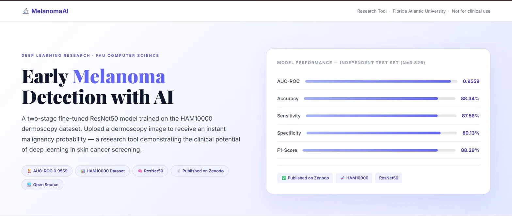
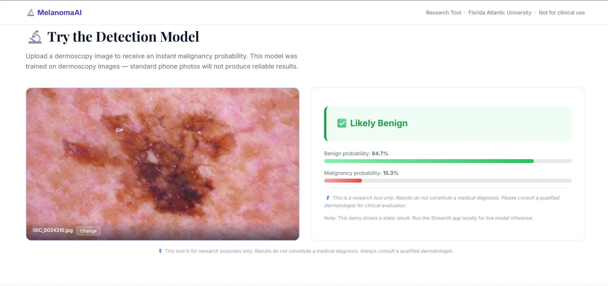
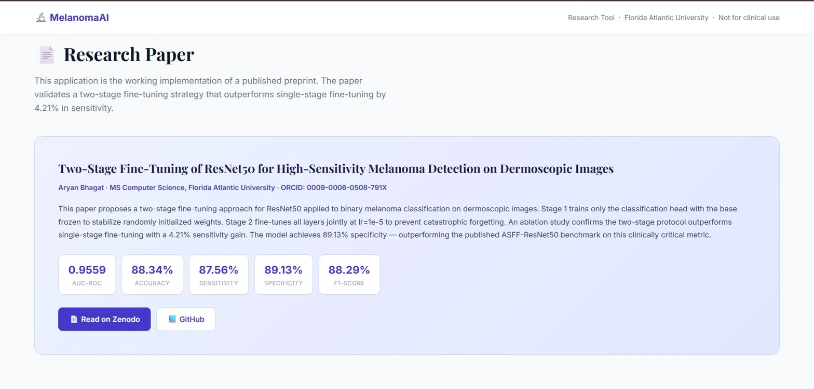
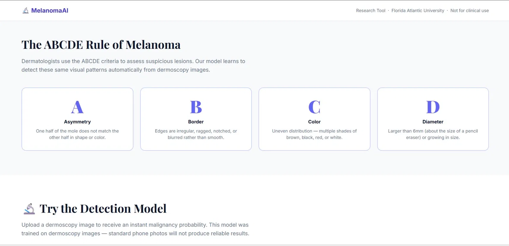

# 🔬 Melanoma Detection — Two-Stage Fine-Tuned ResNet50

[](https://zenodo.org/records/20633541)
[](https://doi.org/10.5281/zenodo.20530234)
[](https://orcid.org/0009-0006-0508-791X)
[](LICENSE)

> **Research preprint published on Zenodo** · MS Computer Science · Florida Atlantic University  
> Author: **Aryan Bhagat** · bhagata2025@fau.edu

---

## 📊 Model Performance

| Metric | Score |
|--------|-------|
| **AUC-ROC** | **0.9559** |
| Accuracy | 88.34% |
| Sensitivity | 87.56% |
| Specificity | **89.13%** *(beats ASFF-ResNet50's 85.42%)* |
| F1-Score | 88.29% |
| Precision | 89.03% |

Evaluated on an independent test set of **3,826 images** with no data leakage — oversampling applied exclusively to the training set after stratified splitting.

---

## 🖥️ Demo Screenshots

### Hero & Model Performance


### Detection Tool — Upload & Result


### Research Paper Section


### ABCDE Rule of Melanoma


---

## 🚀 Quick Start

### Run the Streamlit Detection App
```bash
git clone https://github.com/Aryanbhagat23/melanoma-detection.git
cd melanoma-detection
pip install -r requirements.txt
streamlit run melanoma_detector_app.py
```

### Open the Website
```bash
# Just double-click melanoma_website.html in your browser
# No installation needed
```

> **Note:** The Streamlit app requires `best_melanoma_model.keras` in the same folder.  
> Download the model from [Zenodo](https://zenodo.org/records/20633541) or retrain using `melanoma_research_updated.py`.

---

## 🧠 How It Works — Two-Stage Fine-Tuning

The core contribution of this research is a **two-stage training protocol** that significantly outperforms standard single-stage fine-tuning:

**Stage 1 — Head Stabilization (15 epochs, lr=1e-3)**
- All ResNet50 base layers are frozen
- Only the new classification head is trained
- Prevents early gradient instability from corrupting pretrained ImageNet features

**Stage 2 — Full Fine-Tuning (up to 30 epochs, lr=1e-5)**
- All layers unfrozen and trained jointly
- Very low learning rate prevents catastrophic forgetting
- EarlyStopping with patience=10 on validation loss

**Key insight:** Both training and inference use identical `resnet50.preprocess_input()`. Many published implementations use simple `/255` at inference, causing a systematic input distribution mismatch that degrades real-world performance.

### Ablation Study Results

| Method | Accuracy | Sensitivity | Specificity | AUC |
|--------|----------|-------------|-------------|-----|
| Single-Stage Fine-Tuning | 86.41% | 83.35% | 86.18% | 0.9201 |
| **Two-Stage (Ours)** | **88.34%** | **87.56%** | **89.13%** | **0.9559** |
| Improvement | +1.93% | **+4.21%** | +2.95% | +0.0358 |

---

## 📁 Repository Structure

```
melanoma-detection/
├── melanoma_research_updated.py   # Training script (split-first, then oversample)
├── melanoma_detector_app.py       # Streamlit detection app
├── melanoma_website.html          # Standalone HTML website (no install needed)
├── melanoma_gradcam.py            # Grad-CAM visualization script
├── confusion_matrix.png           # Test set confusion matrix
├── README.md
└── .gitignore
```

---

## 📄 Citation

```bibtex
@misc{bhagat2026melanoma,
  title={Two-Stage Fine-Tuning of ResNet50 for High-Sensitivity Melanoma Detection on Dermoscopic Images},
  author={Bhagat, Aryan},
  year={2026},
  publisher={Zenodo},
  doi={10.5281/zenodo.20530234},
  url={https://zenodo.org/records/20633541}
}
```

---

## 🔗 Links

- 📄 **Published Paper:** [zenodo.org/records/20633541](https://zenodo.org/records/20633541)
- 🆔 **ORCID:** [0009-0006-0508-791X](https://orcid.org/0009-0006-0508-791X)
- 🎓 **Institution:** Florida Atlantic University, Boca Raton FL

---

*⚕️ This tool is for research purposes only and is not intended for clinical diagnosis. Always consult a qualified dermatologist.*